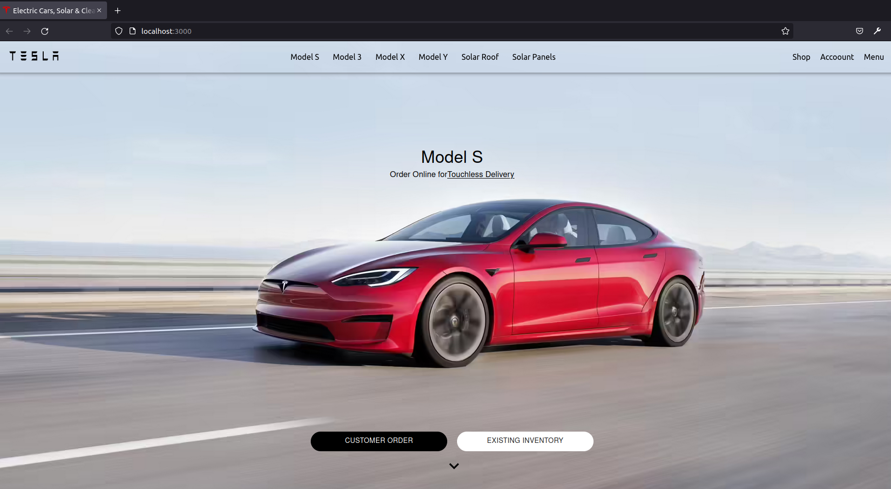

# Getting Started with Create React App

### `npx create-react-app tesla-clone`

### `npm start`

start this project with enter `npm install` in terminal

# Available Scripts

### `npm install @material-ui/core`

### `npm install @material-ui/icons`

### `npm install @material-ui/styles`
